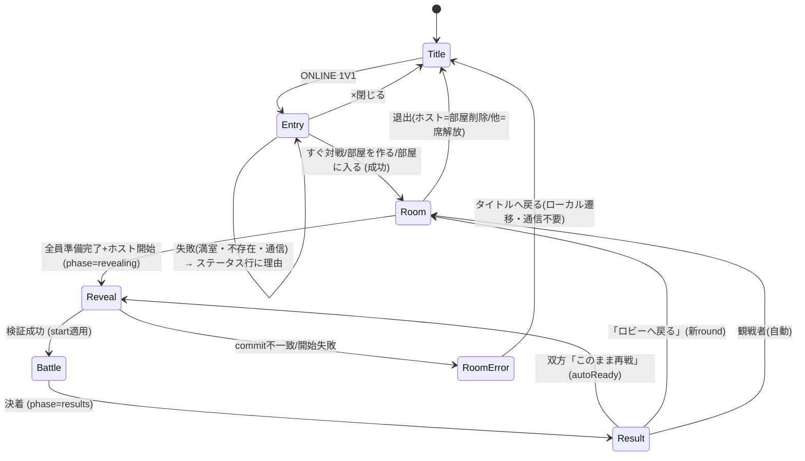

# 設計:対戦ルーム専用ページ化 + BGM(2026-07-27 / Fable 5)

`HANDOFF_2026-07-27_CODEX_TO_CLAUDE.md` §5 の設計依頼に対する回答。
実装はこの文書を仕様として、段階ごとに軽量モデルへ下ろす。

---

## 0. 最重要の判断:Canvasシーンではなく「全画面DOM」で作る

### 結論

**現在のモーダル(`#onlineLobby`)を、同じHTML内の「全画面DOMスクリーン」へ育てる。**
別URLにはしない。Canvasシーンにもしない。`gamePhase` は増やさない。

### 理由(トレードオフの明示)

| 案 | 利点 | 致命的な欠点 |
|---|---|---|
| **A. 全画面DOM(推奨)** | 既存モーダルの資産(IME入力・クリップボード・share API・select要素・CSSクラス状態機械)をそのまま使える。通信コードに一切触れない | 見た目をCanvasの真鍮デザインとCSSで揃える手間。ただし既存モーダルが既に揃えている |
| B. Canvasシーン(`gamePhase = 'room'`) | 描画の統一感 | **合言葉のIME入力・コピー・共有・15キャラのセレクトをCanvasで自作することになる。** コード内コメント(193行目)にも「IMEを自前で作るのは非現実的」と明記済み。さらに `gamePhase === 'title'` を見る箇所全部の追加監査が要る |
| C. 別URL(room.html) | 「ページ」らしさ | 単一HTML構成が壊れる。IIFE内の `online`・transport・スナップショットを共有できず、**通信層の作り直しになる**。PWAのプリキャッシュも二重化する |

判断の決め手はコードの現状にある。ロビーは**既にDOM**であり、DOMである理由
(IME・クリップボード・share)は専用ページ化しても消えない。つまりBとCは
「いま動いている理由」を捨てる案で、Aだけが「いま動いている理由」を伸ばす案。

「専用ページ化」の実体は **(1) 全画面レイアウト (2) ルーム専用BGM (3) 情報の再配置** の3つで、
どれもDOMで達成できる。URLを分ける必然はない。

### `gamePhase` を増やさない理由

ルーム表示中も水面下は `gamePhase = 'title'` のまま(現在と同じ)。
- 全画面DOMが入力を完全に覆うので、Canvas側のタップ処理に混入しない(現在のモーダルと同じ原理)
- `gamePhase === 'title'` / `'select'` を参照する分岐は音・描画・入力に散らばっており、
  新フェーズを足すと**全箇所の監査が必要**になる。得られるのはBGM判定の綺麗さだけ
- BGM判定は §3 の一元管理関数に「ルーム画面が開いているか」という述語を1つ足せば済む

---

## 1. 画面構成

仮想座標ではなくCSSレイアウト(vw/vh基準)。既存の真鍮×黒鉄トーンを踏襲する。

### 1-1. 入口画面(タイトルの ONLINE 1V1 → 全画面表示)

```
┌─────────────────────────┐
│ ONLINE 1V1              [×閉じる] │ ← ヘッダ。×はタイトルへ(常に効く)
│                                   │
│      (エンブレム/キャラ絵)        │ ← 空白を飾る。機能なし
│                                   │
│  ステータス行(通信の状態)        │
│                                   │
│ ┌───────────────────┐ │
│ │      すぐ対戦する(主ボタン)   │ │ ← 全幅・最下段=親指圏
│ └───────────────────┘ │
│        合言葉を使う(文字リンク風)  │ ← 副導線は小さく
└─────────────────────────┘
```

- 「合言葉を使う」で同画面内に入力欄+部屋を作る/入る を展開(現 `code-entry` クラスの流用)
- **キャラ選択はここに置かない**(入室後に選ぶ。現仕様のまま)

### 1-2. ルーム画面(入室後)

```
┌─────────────────────────┐
│ ルーム  [🔗合言葉]        [退出] │ ← 合言葉部屋のみコード+共有。退出は右上(誤タップ圏外)
│ ─────────────────────── │
│ ● P1 ホスト  なまえ    準備完了✓ │
│ ● P2 あなた  なまえ    選択中…  │ ← 席ボード。自分の行を強調
│ ○ S1 観戦    空席               │
│ ○ S2 観戦    空席               │
│ ─────────────────────── │
│ 対戦設定  [地形▼] [風▼] [手番▼] │ ← ホストのみ操作可(現仕様)
│ ─────────────────────── │
│ じぶんのモンスター [セレクト▼]   │
│ ステータス行                     │
│ ┌───────────────────┐ │
│ │   準備完了 / 準備完了を取り消す │ │ ← 全幅・最下段。状態でラベル反転
│ └───────────────────┘ │
│ (ホストのみ:[対戦開始] が上に)   │
└─────────────────────────┘
```

- 相手のキャラは reveal まで**絶対に表示しない**。「選択中…/選択済み」の2状態だけ見せる(commit/reveal維持)
- 準備完了の取り消し可・全員準備までロックなし(現仕様のまま)
- 接続バッジ(●=応答あり/○=空席または応答なし)は既存 `peerLiveness` の表示だけ。**再接続処理はStage 4**

### 1-3. 結果画面 → ルームへの戻り

Canvasの結果画面(勝敗+「このまま再戦/ロビーへ戻る」)は**現状のまま変えない**。
実機QAで練り込んだ直後の領域であり、勝敗を隠さない要件もここで満たされている。
「ロビーへ戻る」で 1-2 のルーム画面が開く(現 `openFirebaseLobby` の接続先が変わるだけ)。

### 1-4. 観戦者

席ボードのS1/S2に表示。試合中は現状どおり観戦。決着後は選択肢なしでルーム画面へ(現仕様)。

---

## 2. 状態遷移

通信プロトコルの状態(`online.phase`)は**一切変えない**。画面はその写像とする。



要件6の担保:`RoomError → Title` と `Room → Title` の画面遷移自体は
**ローカル処理を先に行い、Firebaseへの削除要求は失敗しても無視**する。
(現 `leaveFirebaseLobby` は削除の await が失敗すると戻れない。ここは直す)

---

## 3. BGM:一元管理(ディレクター方式)

### 現状の問題

`playTitleBgm` / `playStageBgm` / `stopStageBgm` の呼び出しが遷移箇所に**約10箇所散在**し、
「遷移を書くたびに止め忘れる」構造になっている(v47の二重BGMはこれが原因)。

### 設計

既存 `refreshBgmPlayback()` を拡張して唯一の決定関数 `syncBgm()` にする。

```
function desiredBgm() {
  if (画面が隠れている)        return 'none';   // 既存のvisibility処理を統合
  if (gamePhase === 'battle')  return 'stage';
  if (ルーム画面が開いている)   return 'room';   // 入口画面・ルーム画面・エラー時
  if (title/select/その他)     return 'title';
}
```

- **遷移箇所は個別の play/stop を呼ばず、`syncBgm()` だけを呼ぶ。** 同時2曲は構造的に不可能になる
- 曲の切替は、WebAudioのgainがある端末は300msフェード、無い端末(iOSのvolume固定)は即切替
- `<audio id="roomBgm" preload="none">` を1本追加。初回ロードを重くしない
- 再戦時:`Result → Reveal` は戦闘が近いのでルーム曲は**鳴らさない**(revealは数秒で通過する)。
  `Result → Room`(ロビーへ戻る)で初めてルーム曲
- バックグラウンド復帰は既存の `suspendAudioForHidden` / `resumeAudioAfterVisible` を
  `syncBgm()` 経由に置き換え、スナップショット方式をやめる(復帰時に「いまの正解」を再計算する方が単純)

### 素材

`assets/room-bgm.mp3` が**新規に必要**。タイトルより静かで、待機に耐えるループ曲。
これはユーザーに用意してもらう(既存BGMと同じ入手経路を想定)。

---

## 4. 失敗時の挙動

| 失敗 | 画面 | 挙動 |
|---|---|---|
| 満室(簡単対戦) | 入口 | 「いま満室です。合言葉での対戦をお試しください」+ 合言葉展開ボタン。**待機列は作らない**(§6) |
| 部屋が無い/合言葉違い | 入口 | ステータス行に理由。入力欄は打ち直せるまま(現仕様維持) |
| 相手離脱(ロビー中) | ルーム | 席ボードが空席に戻る。ホストはそのまま待てる(現仕様維持) |
| 相手離脱(対戦中) | 戦闘 | 既存の liveness / bye 処理のまま。**本設計では触らない** |
| commit/reveal不一致 | ルーム | 赤帯でエラー表示+「通信ログをコピー」+「タイトルへ戻る」 |
| round切替失敗 | 結果 | 現仕様(結果ロビーに留まる)をルーム画面のエラー帯に置換 |
| 通信不能時の退出 | 全画面 | **ローカル遷移を先に実行**、Firebase削除は投げ捨て(失敗無視)。要件6 |

## 5. Stage 4(切断・再入室)との境界

- 本設計は**表示だけ**接続状態を扱う(●/○バッジ、離席の文言)。判定材料は既存 `peerLiveness`
- 再接続・再入室・席の復元は**一切実装しない**。ただし妨げない:
  ルーム画面は `online` オブジェクトの純粋な写像として実装するため、
  Stage 4 が将来 `online` を再構築すれば画面はそのまま復元される
- 結論:**UIを先に作り、Stage 4 を後から差し込む。順序の入れ替えは不要**

## 6. 簡単対戦の満室時:待機列は作らない

理由:待機列にはマッチング権威(誰と誰を組むか決める場所)が要る。クライアントだけで作ると
競合時の一貫性がFirebaseルールの大改修になり、「通信プロトコルを触らない」制約に反する。
2人規模の想定なら合言葉への誘導で足りる。将来必要になったら独立案件として設計する。

---

## 7. 改修範囲と壊しうる場所

### 触るもの

| 領域 | 内容 |
|---|---|
| CSS(59〜185行) | モーダル→全画面レイアウトへ書き換え。**クラス名(`in-room`/`code-entry`/`results`/`host`/`quickplay`/`busy`)は温存** |
| DOM(205〜241行) | 席ボード・ヘッダ・ボタン配置の再構成。**id は全部温存**(イベント登録が握っているため) |
| `renderFirebaseLobby()` | 席ボードの描画先変更。名前・準備・接続バッジ |
| `refreshBgmPlayback()` ほかBGM約10箇所 | `syncBgm()` へ統合 |
| `leaveFirebaseLobby()` | ローカル遷移先行に変更+confirm()を画面内確認に置換 |
| `index.html` `<audio>` | roomBgm 追加 |

### 触らないもの(明示)

- `netSend` / `netReceive` / transport / Firebaseルール / commit-reveal / round切替
- Canvasの結果画面とそのボタン
- `beginFirebaseOnline` の通信部分(クラス付けの行だけ変わる)

### 壊しうる場所(先に言う)

1. **stage3test がCSSセレクタとBGM呼び出しを文字列で固定している**
   (471〜495行のセレクタ検査、285行の `stopStageBgm();` 検査など)。
   実装コミットで**テストも同時に**新構造へ更新する。テストを先に緩めてはいけない
2. CSSクラス状態機械は表示のON/OFFを担う実働部品。restyle中にセレクタを1つ落とすと
   「ボタンはあるのに見えない」系の不具合になる。段階R1で全状態のスクリーンショット確認を行う
3. BGM統合は呼び出し箇所が多く、1箇所の置換漏れ=二重再生の再発。
   置換後に `playStageBgm\|playTitleBgm` を grep して「syncBgm以外から呼ばれていない」ことを
   テストで固定する

---

## 8. 段階分け(各段階で実機に出す)

| 段階 | 内容 | リスク | 実機で見ること |
|---|---|---|---|
| **R1** | 全画面レイアウト化(ロジック無変更・クラス/id温存) | 低 | 入口→入室→準備→開始→結果→再戦/戻るの全画面が正しく出る |
| **R2** | BGMディレクター統合(**ルーム曲はまだ入れない**。title/stageの2曲のまま挙動同一) | 中 | 全遷移+バックグラウンド復帰で二重BGM・無音が無い |
| **R3** | roomBgm追加+ディレクターに組み込み | 低 | ルーム曲の開始/停止/フェード、再戦時に鳴らないこと |
| **R4** | 席ボード仕上げ(名前・準備✓・接続バッジ・画面内退出確認) | 低 | 観戦席の見え方、離席表示 |

R2を独立させるのが要点。**一番壊れやすい統合を「見た目が何も変わらないはず」の段階として
単独で出す**ことで、壊れたときの原因を一意にする。

## 9. 未確定事項

1. **ルームBGMの素材が無い。** ユーザーの用意待ち(R3の前提。R1/R2は進められる)
2. ルーム画面の背景を静止画にするか、Canvasのタイトル背景を透かすか(R1実装時に両方試して選ぶ)
3. 入口画面のエンブレム絵(既存 `loading-emblem.png` 流用で開始し、不満なら差し替え)
